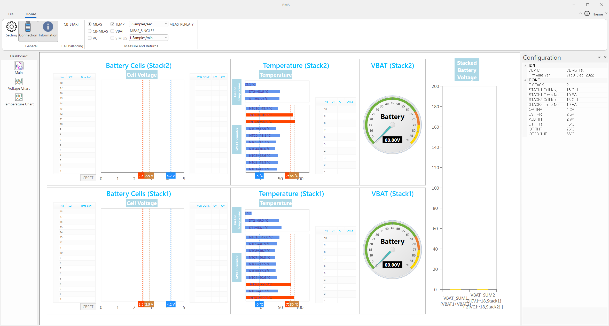

# BMS
* BMS 는 Battery Management System 의 GUI 프로그램으로, 셀 밸런싱 (CB) 및 온도 측정 등 각종 배터리 제어에 대한 정보를 Dashboard 형태로 제공한다.
* 사용 예시)    
 

# Dashboard Page구성
* Main Page, Voltage Chart Page, Temperature Chart Page의 3가지 page로 구성된다.
## Main Page
  * 전체 데이터를 볼 수 있다.
  

## Voltage Chart Page
  * 실시간 Cell Voltage 변화를 볼 수 있다.
  

## Tempterature Chart Page
  * 실시간 Temperature 변화를 볼 수 있다.
  

# 1. 연결
##  Setting
* serial communication 를 위해 Port 와 Buadrate 를 설정한다.  
  

##  Connection
* setting 값으로 connection 한다. 
* connection 완료 시 dashboard 에 IDN, CONF 정보가 표시된다.  
  * Connection 전
    
  * Connection 후
    

##  Information
* Configuration docking bar 를 on / off 한다. (default on)
* Configuration docking bar 는 IDN, CONF 정보를 표시한다.
  * on
    
  * off
    

# 2. 설정 및 실행
## 설정
* 'MEAS', 'CB-MEAS' 2가지 type 설정이 존재한다.  
    
  * 'MEAS' type 에선 'VC', 'TEMP', 'VBAT' 3가지 mode 설정이 가능하다.  
       
  * 'CB-MEAS' type 에선 'STATUS' 의 mode 설정이 가능하다.  
    
## 실행
### '단일 실행'과 '반복 실행' 이 존재한다.
*  단일 실행
  * connection 완료, type 및 mode 설정이 완료된 경우에만 버튼이 활성화 된다.
  * 버튼 클릭 시, 설정된 'type' 과 'mode' 에 맞춰 동작을 한번 실행한다. (mode 는 중첩 선택 가능)
  * ex) MEAS type에 TEMP, VBAT mode가 설정된 경우  
    
*  반복 실행
  * 설정된 주기로  동작을 반복 해서 실행한다.
      * MEAS 반복 주기  
      
      * CB-MEAS 반복 주기  
      

# 3. 동작 실행 예시
# MEAS
### ex) VC
  * Main Page
    * Cell Voltage 그래프와 Stacked Battery Voltage 그래프가 나타난다.
    
  * Voltage Chart Page
    * check 된 범례에 대해서 실시간 변화 그래프가 나타난다. (default all check)
    

## ex) TEMP
  * Main Page
    * Temperature 그래프가 나타난다.
    
  * Temperature Chart Page
    * check 된 범례에 대해서 실시간 변화 그래프가 나타난다. (default all check)
    

## ex) VBAT
  * VBAT 게이지와 Stacked Battery Voltage 그래프가 나타난다.
    

# CB-MEAS
## ex) none check
  * Time Left 가 표시된다.
    
## ex) STATUS
  * Status 정보가 나타난다.
    

## CB 동작 실행 루틴
  * CB 시간값 설정  
  
  * CBSET 버튼을 클릭하여 설정한 CB 시간값 적용  
    
  * 
    * 버튼 클릭 시 적용된 CB 시간값으로 CB 동작 수행
